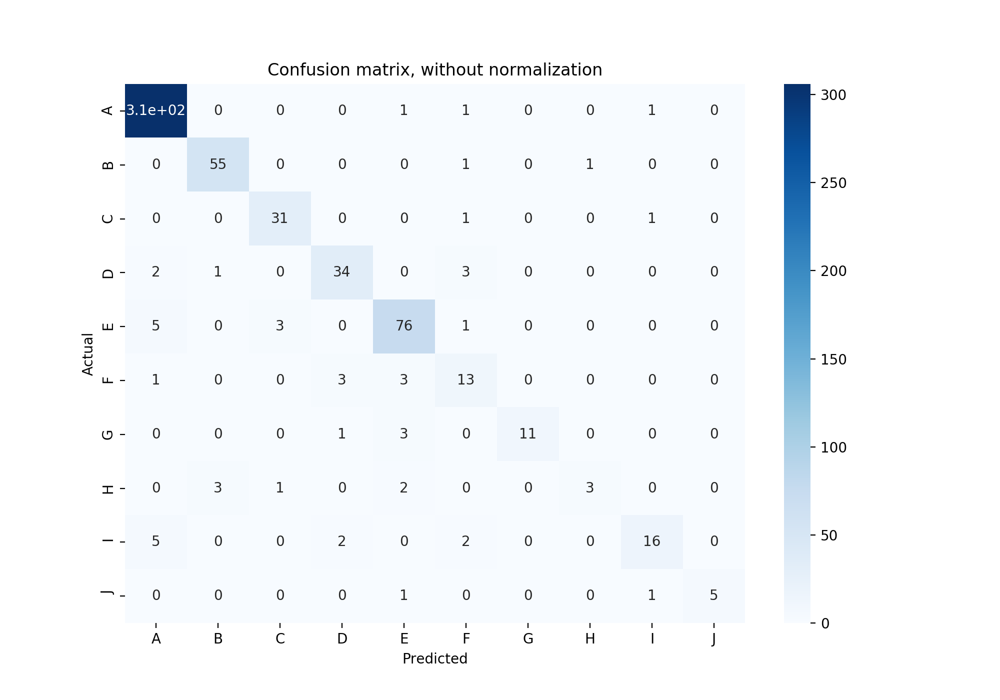

# Classification-Challenge

> Authors Julien MARTIN-PRIN ([@Flexiboy](https://github.com/Flexiboy))

*This project is made within the Datascience and IA course in Year 3 of Engineering @ESILV*

> You will need sci-kit learn to run this script unless you comment the sklearn related stuff

## Project description

The classification challenge goal is to test our own implementation of the K-nn algorithm on a pre-selected dataset. The dataset used to train the K-nn is the file called `data.csv`. The data to test our algorithm is stored in the file `preTest.csv`. We have 4 input variable and a label to guess. There is 10 different labels.
> PS: All the data is located in the data folder, which also contains the initial subject (instructions in the pdf)

## Code explanation

**Loading the data:**

```python
def load(path):
	data = []
        temp = []
        with open(path, "r") as inp:
		for i in inp:
			for j in range(len(i.split(';'))):
                                 if j == 4:
                                         temp.append((i.split(';')[j]).split('\n')[0])
                                 else:
                                         temp.append(i.split(';')[j])
                         data.append(temp)
                         temp = []
         return data
```

Here, we are loading the data from a specified path. The data is also fromated to be much more easy to read in the future part of our programm.

**Combining the data:**

```python
def combine(data1, data2):
	final = data1
	for i in data2:
		final.append(i)
	return final
```

This method is combinig 2 arrays of data.

**Calculating the euclidian distance:**

```python
def distance(reference, test_subject):
	dist = []
	for i in range(4):
		dist.append(float(abs(reference[i] - test_subject[i])))
	dist.append(reference[4])
	return dist
```

In this function, we are calculating the euclidian distance between a testing subject (a subject which we want to determine its label) and the a reference subject (a subject in our dataset).
> This can be resumed as calculating the euclidian distance between two subjects and associate the distance array with a label (here `reference[4]`).

**Getting the summ:**

```python
def summ(distlist):
	dist_summ = 0
	for i in distlist:
		if isinstance(i, float):
			dist_summ += i
	return dist_summ
```

In this section, we are summing each distance of a specified array (here distlist) to be able to better sort the distances array (matrix of distance arrays).

**Getting the distances with the Minkwosky algorithm:**

```python
def min(distlist):
	mink_dist = 0
	for i in distlist:
		if isinstance(i, float):
			mink_dist += i ** 4
	return mink_dist ** 0.25
```

In this method, we are calculating the distance from a testing subject to a referende subject using the Minkwoski algorithm. The most efficient parameter for this specific dataset is p = 4. The difference between the Manhattan and the Minkwoski algorithm on the predictions is about +1.3% of better accuracy.

**Getting the top-k:**

```python
def distance_list(dataset, test_subject, k):
	distlist = []
	for i in dataset:
		distlist.append(distance(i, test_subject))
	final = sorted(distlist, key=lambda dist: mink(dist))
	return final[:k]
```

This is one of the two programm's core (the other one being the association). Here we are getting the distances from a specified subject (here `test_subject`) to all the subject in the dataset.
> In each iterations, we are getting the distance from the testing subject to a different subject in the dataset, each iteration representing a distinct subject.
Because we only want to sort the array with the distances parameters, we are appling a lambda function wich calculates the distances with th eminkwosky algorithm. 
At the end, we only need the top-k distances (the closest distances from the testing subject if you prefer) so we only return the k-first row of the sorted array.

**Counting the elements:**

```python
def element_count(array, index, to_find):
	number = 0
	for i in array:
		if i[index] == to_find:
			number += 1
	return number
```

This is the part where we count the labels (understand, we are counting the number of 'A' or 'B' or 'C' etc...). The first parameter refers to our top-k list, the second paramter is where to find what we are searching in each row and the last one is what we are searching ('A', 'B', 'C', etc...).

**The association:**

```python
def associate(evl, test_subject):
	array = []
	a = element_count(evl, 4, 'A')
	b = element_count(evl, 4, 'B')
	c = element_count(evl, 4, 'C')
	d = element_count(evl, 4, 'D')
	e = element_count(evl, 4, 'E')
	f = element_count(evl, 4, 'F')
	g = element_count(evl, 4, 'G')
	h = element_count(evl, 4, 'H')
	i = element_count(evl, 4, 'I')
	j = element_count(evl, 4, 'J')
	count = [a, b, c, d, e, f, g, h, i, j]

	if max(count) == a:
		test_subject.append('A')
	elif max(count) == b:
		test_subject.append('B')
	elif max(count) == c:
		test_subject.append('C')
	elif max(count) == d:
		test_subject.append('D')
	elif max(count) == e:
		test_subject.append('E')
	elif max(count) == f:
		test_subject.append('F')
	elif max(count) == g:
		test_subject.append('G')
	elif max(count) == h:
		test_subject.append('H')
	elif max(count) == i:
		test_subject.append('I')
	elif max(count) == j:
		test_subject.append('J')

	return test_subject
```

This is the second programm's core. This function associates a subject to a label. At first, we count the occurence number of each label and then we are associating a subject to the label that has the maximum occurence.

**Getting an output:**

```python
def show(data):
	for i in data:
		print(i)
```

This function only print an array.

**The confusion matrix:**

```python
def confusion_mat(data, first_index):
	actual = []
	predicted = []
	for i in data:
	actual.append(i[first_index])
	predicted.append(i[first_index + 1])

	results = confusion_matrix(actual, predicted)
	results_normalized = results.astype('float') / results.sum(axis=1)[:, np.newaxis]
	print(f'Accuracy score: {accuracy_score(actual, predicted)}')
	print('Report:')
	print(classification_report(actual, predicted))

	df_cm = pd.DataFrame(results, index = [i for i in "ABCDEFGHIJ"], columns = [i for i in "ABCDEFGHIJ"])
	df_cm.index.name = 'Actual'
	df_cm.columns.name = 'Predicted'
	plt.figure(figsize = (10, 7))
	plt.title('Confusion matrix, without normalization')
	sn.heatmap(df_cm, cmap=plt.cm.Blues, annot=True)

	df_cm_nm = pd.DataFrame(results_normalized, index = [i for i in "ABCDEFGHIJ"], columns = [i for i in "ABCDEFG    HIJ"])
	df_cm_nm.index.name = 'Actual'
	df_cm_nm.columns.name = 'Predicted'
	plt.figure(figsize = (10, 7))
	plt.title('Confusion matrix, normalized')
	sn.heatmap(df_cm_nm, cmap=plt.cm.Blues, annot=True)

	with open("results/classification_report.txt", "w") as out:
		for i in classification_report(actual, predicted):
			out.write(i)
	plt.show()
```

This function is used to generate a confusion matrix

**The output:**

```python
def output(data):
	with open('results.txt', "w") as out:
		for i in data:
			out.write(f'{i[4]}\n')
```

**The main:**

```python
def main():
	t0 = time.perf_counter()
	data1 = load('data/data.csv')
	data2 = load('data/preTest.csv')
	data = combine(data1, data2)
	evaluate = load('data/finalTest.csv')
#	minval = minvalues(data)
#	maxval = maxvalues(data)
#	rescaled_data = rescale(data, maxval, minval)
#	rescaled_evaluate = rescale(data, maxval, minval)
	k = 5
	final = []

	for i in evaluate:
		final.append(associate(distance_list(data, i, k), i))

	t1 = time.perf_counter()
	print(f'time elapsed: {t1 - t0}')
#	confusion_mat(final, 4)
	output(final)
```

This is the main. We are just running the programm here and setting the k (so the limit for the top-k distances). We are also sending the output to a file called `result.csv`. We are also showing the time elapsed.

## Results

> I first ran the program with k = 20, but after a brute force test, it appears that the best accuracy score we can obtain with this specific dataset and this specific algorithm is obtained by setting k = 8. So I updated the confusion matrix and the calssification report below
> Edit: it appears that with the minkwosky algorithm, we have a better accuracy (88% vs 89.17%). The best results are obtained with the minkwoski algorithm with k = 5 and p = 4
> Last edit: in order to complete the homework, I added the preTest data in the training dataset. So the following results are obtained with the data.csv and the preTest.csv files combined

**Confusion matrix without normalization:**



**Normalized confusion matrix:**


**Classification report:**


## Ways to improve the program

So as I mentionned earlier, with this specific dataset, the best accuracy score is obtained by setting k = 8. Another way to improve the program might be to introduce a normalization for each label and testing it with the actual method.

Here is the rescaling algorithm:

```python
def minvalues(data):
	minX, minY, minZ, minT = inf, inf, inf, inf
	for i in data:
		if i[0] < minX:
			minX = i[0]
		if i[1] < minY:
			minY = i[1]
		if i[2] < minZ:
			minZ = i[2]
		if i[3] < minT:
			minT = i[3]
	return minX, minY, minZ, minT
```

Here we are getting the minimum values for each feature.

```python
def maxvalues(data):
	maxX, maxY, maxZ, maxT = -inf, -inf, -inf, -inf
	for i in data:
		if i[0] > maxX:
			maxX = i[0]
		if i[1] > maxY:
			maxY = i[1]
		if i[2] > maxZ:
			maxZ = i[2]
		if i[3] > maxT:
			maxT = i[3]
	return maxX, maxY, maxZ, maxT
```

Here we are getting the maximum values for each feature.

```python
def rescale(data, maxval, minval):
	final = []
	temp = []
	for i in data:
		for j in range(4):
			temp.append((i[j] - minval[j]) / (maxval[j] - minval[j]))
		if len(i) == 5:
			temp.append(i[4])
		final.append(temp)
		temp = []
	return final
```

Here we are just using the min-max rescaling algorithm. The formula is xi' = (xi - min(x)) / (max(x) - min(x)). Where x is the feature vector, xi the feature to recale and xi' the rescaled  feature.

Unfortunatly, I wasn't able to get any improvement in the algorithm using the rescaling. So I dropped it.

## Dataset

> Here is the dataset represented in graphs


